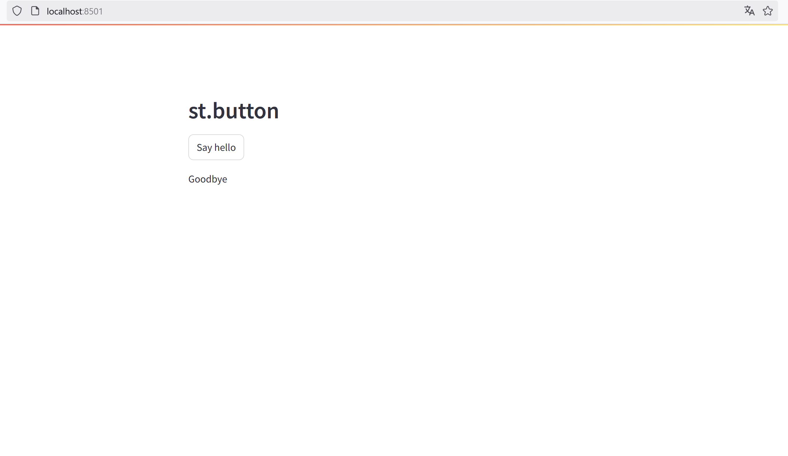

# Worklog on 30 Days of streamlit

Basierend auf [30days Streamlit](https://30days.streamlit.app/)

## Day 1
Mit `conda create -n stenv python=3.11` habe ich eine Conda-Umgebung mit dem Namen `stenv` und der Python-Version `3.11` erstellt.
- [ ] Ich frage mich, wo diese wohl erstellt wird.

> 💡 Beim Initialisieren musste ich zunächst in VS Code das Terminal von `psh` zu `cmd` wechseln, da PowerShell aus irgendeinem Grund `conda` nicht aktivieren wollte. Daraufhin habe ich dann `conda init` und `conda activate stenv` gemacht.

## Day 2
Meine leere `streamlit_app.py` Datei habe ich lieber mit `type nul > streamlit_app.py` in der Kommandozeile erstellt. Mit `streamlit run streamlit_app.py` läuft die App dann auch lokal.

## Day 3
Ich habe einen Button erstellt mit `st.button`. Yay, ist doch wunderschön, oder?



## Day 4
joa... hier habe ich mir ein Video angeschaut.
Cool zu sehen wie er Lamda functions nutzt und wie man einfache Dashboard bauen kann.

## Day 5
ich habe noch ein Bild hinzugefügt.

## Day 6
app nach github gepusht

## Day 7
geskipped, weil ich es nicht in der streamlit community publishen will. Ansonsten wäre es der Plan die App an dieser Stelle dort zu hosten

## Day 8
okay, man kann nice sliders erstellen und deren Werte auslesen.
```python
values = st.slider(
     'Select a range of values and set a step',
     0.0, 100.0, (25.0, 75.0))
st.write('Lower bound value:', values[0], 'Upper bound value:', values[1])
```
### Code Erklärung
- `st.slider`: Erstellt ein Slider-Widget.
- `'Select a range of values and set a step'`: Beschriftung für den Slider.
- `0.0, 100.0, 1.0`: Mindest- und Höchstwerte für den Slider und Schritt.
- `(25.0, 75.0)`: Standardmäßig ausgewählter Bereich.
- `st.write`: Zeigt die ausgewählten unteren und oberen Grenzwerte des Sliders an.

## Day 9
Die Erstellung eines einfach Charts geht mit dem `st.line_chart` Befehl der auf dem `st.altair_chart` Befehlt basiert. Hier habe ich ein bisschen mehr herumexperimentiert. Siehe dazu auch `streamlit_app_day10.py`.

## Day 10
Auswahlboxen kann man easy mit `st.selectbox` erstellen. Die Auswahl kann man dann weiter im Code nutzen indem die Auswahl einer Variable zugewiesen wird und diese weiter genutzt wird.

## Day 11
Es gibt mit `st.multiselect` auch die Möglichkeit eine Mehrfachauswahl zu ermöglichen.